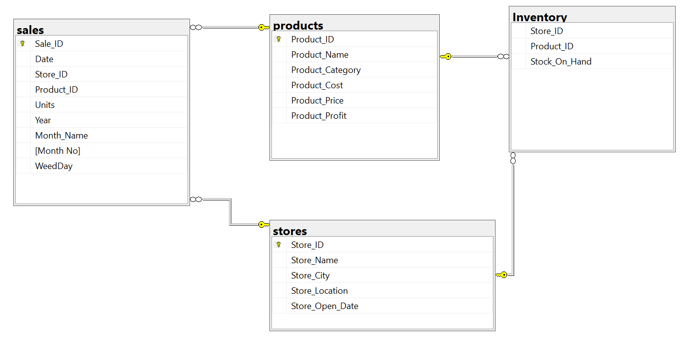

# Maven Toys Sales Analysis

---
# Introduction
This is a SQL project that aims to provide **Maven Toys**, a fictional chain of toy stores in Mexico, with actionable insights into product profitability, seasonal sales trends, stock outs impact, and inventory efficiency.

# Table Of Content
- [Project Overview]()
- [Project Scope]()
- [Business Objective]()
- [Document Purpose]()
- [Use Case]()
- [Skills/Concepts Demonstrated]()
- [Data Source]()
- [Data Cleaning and Processing]()
- [Data Analysis and Insight]()
- [Recommendation]()
- [Conclusion]()

# Project Overview
The objective of the Maven Toy Sales and Inventory Analysis project is to offer practical insights regarding product profitability, seasonal sales patterns, the impact of stockouts, and inventory efficiency to Maven Toys, a fictitious chain of toy stores in Mexico.

The goal of this project is to thoroughly analyze the data from Maven Toys to pinpoint important areas in need of enhancement and optimization.

# Project Scope
This project entails a thorough analysis of Maven Toys' sales and inventory data, including stores, inventory levels, daily sales and products. The analysis covers data from January 1, 2022, to September 30, 2023, to provide a comprehensive view of Maven Toys' operational performance.

# Business Objective
The main goal of the Maven Toys Sales and Inventory project is to find the product categories that bring in the most profits and check if these categories are consistently profitable in all store locations. it seeks to ascertain the patterns and trends in sales over different time periods, identify any potential loss of sales due to out-of-stock products at specific locations, and determine the amount of money tied up in inventory at the toy stores and how long it will last.

# Document Purpose
This documentation serves as a guide for project stakeholders, providing insights into the project's objectives, data sources, data analysis, and any other relevant information.

# Use Case
The insights gained from the analysis of Maven Toys sales can assist multiple stakeholders. The following important parties may find this analysis useful and advantageous.

 **1.	Maven Toys Executives and Management:**
Executives and upper management can use the analysis to make informed decisions about product offerings, store locations, and overall business strategy.

 **2.	Sales Teams:**
Based on the analysis, sales teams can identify possible opportunities for growth, Sales team optimization in consideration of productivity, and gain insight into popular products, customer preferences, and sales trends.

 **3.	Inventory managers:** 
By using the analysis, those in charge of inventory can improve retail sales inventory stocking plans, spot slow-moving goods, and lower the frequency of stock-outs.

**4.	Marketing Teams:**
By utilizing the analysis, marketing teams can align their marketing campaigns with the most profitable product categories and customize promotional strategies, particularly during peak seasons.

**5.	Store managers:**
Store managers can enhance their individual store operations by utilizing inventory management strategies, ensuring proper brand visibility at the stores for top selling products, seasonal trends, and insights into product performance.

# Skills/ Concepts Demonstrated
The following SQL features were incorporated:
- Data Connection in Microsoft SQL Server
- Data Cleaning and Processing
- Developed a Database Schema
- Data Analysis
- Join
- CTE (Common Table Expression)
- SQL Window Functions
  
# Data Source
The project utilizes a dataset containing information on sales and inventory. The dataset used for this analysis was downloaded from [Mavin Analytics](https://www.mavenanalytics.io/data-playground?page=9&pageSize=5)  website where datasets are available for practice purposes. The dataset is a CSV file, and it consists of four main tables which are sales table, product table, inventory table, and store table.

The product table, which has 35 rows and 5 columns, contains information about the goods that Maven Toys sells. The table contains details about each product, including its name, category, cost, and price. Each product is uniquely identified by its Product ID.
The inventory table shows the current stock levels of every product in every store. It has 1,593 rows and 3 columns. The columns include Product ID, Store ID, and Stock on Hand.
Store table comprises 50 rows and 5 columns. The columns include Store ID, Store Name, Store City, Store Location, and Store Open Date.
The sales table, which includes 829,262 rows and 5 columns, records the quantity and type of products sold. With columns for Sale ID, Date, Store ID, Product ID, and Units, this table offers insights into daily sales activity.

# Data Cleaning and Processing
Data cleaning is necessary because the accuracy and dependability of the input data have a significant impact on the quality of analysis and insights obtained from it. Inaccurate conclusions and difficulty making decisions can result from incomplete or inconsistent data. I can make sure that my analyses are based on a strong foundation and produce more dependable results and well-informed decision-making by carefully cleaning and preparing the data.

For each table used in the analysis, extensive data cleaning procedures were carried out. For every table, the following steps were taken to guarantee high data accuracy and integrity and to improve the dataset's high quality.

**1. Correcting Data Types:**

Ensured that data types are appropriate for the values in each column, converting datatype if needed.

**2. Recognizing and Managing Null Values:**
Extensive checks were conducted to detect and manage any occurrences of null values on the primary columns in every table. In this dataset, null values denote missing or insufficient data. Therefore, by guaranteeing that every observation contains all relevant information, addressing rows with null values helps maintain the dataset's overall integrity. Results from incomplete data analysis can be deceptive.

Upon executing a query to identify null values in each table, the output indicates that every table involved in this analysis contains complete information. Importantly, there are no instances of null values detected in the key columns across all tables, highlighting the completeness and data integrity of the dataset used for this analysis.

**3. Handling Duplicates:**

Duplicate records were found and eliminated to prevent redundancy and preserve data integrity.

After running a query to find and remove all duplicate rows in each table, it has been confirmed that every table used in this analysis is free of duplicate rows. Each row in these tables contains unique information, ensuring the integrity of the dataset and providing distinct and valuable data for the analysis.

**4. Standardizing Data:**

Ensuring uniformity in data representation and format, including text case and date formats. 

During the data processing phase, the following procedures were also completed.

- **_Added a new column_**
  
A new column called "product profit" was added to the product table, calculating the profit for each product.  This column is essential for determining which product category is profitable, as it offers insightful information about the most lucrative product categories.

New columns were also added to the sales table. These are Weekday, Month Number, Month Name, and Year, these additions are crucial for a thorough look at sales trends. Businesses can quickly identify trends with these columns, such as which days, months, or years have higher sales. Making informed decisions about product inventory management, promotion scheduling, and general business strategy is made easier with the use of this information.

# Established Relationships Between Tables.
Establishing connections between the tables is essential to this analysis. In addition to keeping the data organized, it also facilitates quicker query execution, prevents needless data duplication, and creates a flexible database structure.



Relationships make it possible for queries to use JOIN operations, which combines and retrieves data from several tables in a single query. This results in a more streamlined and effective data retrieval process. Relationships help prevent information from being duplicated in multiple tables, improve storage efficiency, and simplify database maintenance. The relationships between various database entities are clearly shown by relationships. This helps with efficient data modeling and improves the database structure's readability.

**_For the complete data cleaning documentation_**, [_Click Here_](Toys_Sales.pdf)

# Data Analysis and Insight

This project aims to identify the most profitable product categories and determine whether these categories are profitable across all store locations. In addition, to find patterns and trends in sales over various time periods, spot any possible loss of sales from out-of-stock merchandise at locations, and calculate the total amount of money locked up in inventory at the toy stores—as well as how long it will last.

This analysis provides answers to the following questions.

# 1.Which product categories drive the biggest profits? Is this the same across store locations?

This question is seeking to understand the relationship between product categories, profitability, and potential variations across different store locations. 
Finding and ranking the product categories that make a substantial contribution to the business's overall profitability is the aim of the first section of the question. To answer this query, a comprehensive SQL query was run to determine the total profit that was made by each product category as well as the percentage that each category contributed to the overall profit. This query provides a comprehensive overview of the profitability distribution across product categories.

```SQL
--Profit by Product Category
SELECT	Product_Category,
        SUM(Product_Profit * Sales.Units) AS Total_Profit,
	      ROUND(SUM(Product_Profit * Sales.Units) / (SELECT SUM(Product_Profit * Sales.Units) 
		    FROM Products
		JOIN Sales
		ON products.Product_ID = Sales.Product_ID)*100,2) AS [%Profit]
FROM   Products
JOIN   SALES 
ON     products.Product_ID = Sales.Product_ID
GROUP BY Product_Category	
ORDER BY Total_Profit DESC
```
    
 |Product_Category |Total_Profit|%Profit |
|--------------|-----------------|--------------|
|Toys|1079527  |26.89% |
|Electronics|1001437|24.95% |
|Art & Crafts |753354   |18.77% |
|Games  |673993|16.79% | 
|Sports & Outdoors  |505718|12.6% | 
      
- According to the above analysis, Toys produced the most profit of all the categories, totaling $1,079,527, and accounting for 26.89% of the total profit. This indicate that the Toys category makes up a sizeable portion of the overall profit
With profits of $1,001,437 and $753,354, which account for 24.95% and 18.77% of the total profit, respectively, Electronics and Art & Crafts are closely behind Toys. These categories also make significant contributions to the total profit as well.
Profits from Games and Sports & Outdoors were $673,993 and $505,718, respectively, making up 16.79% and 12.60% of the total profit. They are not as profitable as Toys, Electronics, and Arts & Crafts, but they still make a sizable contribution to the total profit.

- The second part of the question explores whether the profitability of product categories remains consistent or varies across different store locations. It suggests an investigation into whether certain product categories perform exceptionally well in specific stores or if the profitability distribution is uniform across all locations. To provide answers to the second part of the question, a comprehensive SQL query that calculates the total profit generated by each product category across different store locations was executed.
  
The second part of the question explores whether the profitability of product categories remains consistent or varies across different store locations. It suggests an investigation into whether certain product categories perform exceptionally well in specific stores or if the profitability distribution is uniform across all locations. To provide answers to the second part of the question, a comprehensive SQL query that calculates the total profit generated by each product category across different store locations was executed.

```SQL
--Profit by Product Category and Store Location
WITH CTE
AS
(SELECT		Store_Location,
		      Product_Category,
		      ROUND(SUM(Product_Profit * Sales.Units), 0) AS Total_Profit
FROM	  	Products
JOIN	  	Sales
ON		    Products.Product_ID = Sales.Product_ID
JOIN		  Stores
ON		    Stores.Store_ID = Sales.Store_ID
GROUP BY	Product_Category,
		      Store_Location)
SELECT		Store_Location,
  	[Toys],
		[Electronics],
		[Art & Crafts],
		[Games],
		[Sports & Outdoors]   
FROM		CTE
PIVOT  (SUM (Total_Profit)
		FOR Product_Category
		IN  ([Toys], [Electronics], [Art & Crafts], [Games], [Sports & Outdoors])) AS PIVOT_
ORDER BY	Store_Location
```

|Store_Location|Toys |Electronics|Art & Crafts|Games| Sports & Outdoors |
|--------------|-----------------|--------------|------------|--------------|---------------------|
|Airport|88250|108197|61441|80768|39393|
|Commercial|225034|287574|155461|146296|112499|
|Downtown|630029|502490|444320|378421|293468|
|Residential|136214|103176|92132|68508|60358|

- Based on the analysis above, there are significant differences in profitability between different store locations for 
 each product category. In terms of profitability, each location has a distinct top-performing category. Electronics is the 
 category with the best performance at the airport. Electronics is also the category with the best performance in the 
 commercial location. Toys are the category with the highest performance in both the residential and downtown locations.

 - The category that stands out as the most profitable and dominant in airport and commercial locations is electronics. 
  This implies that there is a greater need for electronics in these environments, which may be fueled by the type of 
 people  who travel through airports and the commercial nature of the business district.

- In both Downtown and Residential locations, the Toys category routinely ranks as the highest performing category, 
 demonstrating its robust market appeal in these contexts.

# 2. Can you find any seasonal trends or patterns in the sales data?
To obtain important insights into the changing behaviors, trends, and general patterns within the dataset over time, a comprehensive time-based analysis was carried out to find seasonal trends or patterns in the sales data. For this project, a sophisticated understanding of the intricate behaviors and fluctuations within the sales data throughout different years was made possible by the execution of a comprehensive SQL query intended to calculate the total revenue for each month across different years.

```SQL
-- Revenue Trend Over Time

SELECT		Month_Name,
		CASE WHEN [2022] IS NULL THEN 0 ELSE [2022] END AS [2022],
		CASE WHEN [2023] IS NULL THEN 0 ELSE [2023] END AS [2023]
FROM
(SELECT 	Month_Name,
		 [Month No],
		[Year],
		ROUND(SUM(Product_Price*Sales.Units), 0) AS Revenue
FROM	 	Products
JOIN	  	Sales
ON	 	Products.Product_ID = Sales.Product_ID
JOIN	  	Stores
ON	  	Stores.Store_ID = Sales.Store_ID
GROUP BY 	Month_Name,
		 [Month No],
		[Year]) AS Y
PIVOT(		SUM(Revenue)
		FOR [Year]
		IN ( [2022], [2023])) AS PIV_
ORDER BY 	 [Month No]

```
|Month_Name|2022|2023|
|--------------|-----------------|--------------|
|January|542555|747196|
|February|541352|722632|
|March|589485|883516|
|April|681073|827691|
|May|672370|825319|
|June|661980|808299|
|July|556034|828349|
|August|489423|660877|
|September|585844|658194|
|October|623874|0|
|November|661304|0|
|December|877204|0|

The revenue generated for each month, comparing 2022 to 2023, provides insights into the performance of each period:
**in 2022**
- There is a general revenue growth from January to December, peaking at $877,204 in December. This suggests that consumer participation and spending have been favorable this year.
Compared to the previous months, August's revenue slightly decreased, which could have been caused by seasonal variations or shifts in summertime consumer behavior.

- With revenue rising to $585,844, September represents a recovery and may signal an increase in consumer spending as the summer comes to an end.
- October and November continue to have consistent revenue—$621,304 and $623,874, respectively.
- Revenue increased significantly in December, reaching $877,204, making it stand out. Possible explanations for this include higher holiday spending, joyous promotions, or unique occasions.

**in 2023**
- The first quarter of the year, from January to March, exhibits consistent revenue growth, reaching a peak in March at 
 $883,516. This suggests positive consumer engagement and purchasing during the early months of the year.
- April and May maintain stable revenue levels, indicating sustained consumer interest and spending during the spring 
 season.
- From June onwards, there is a gradual decline in revenue, reaching its lowest point in September at $658,194. This 
 decline could be influenced by various factors such as seasonal trends, changing consumer preferences, or market dynamics.
- October, November, and December, the recorded revenue sharply declined, ultimately reaching zero. This decline was 
  primarily attributed to the absence of sales during this period.

# 3. Are sales being lost with out-of-stock products at certain locations?
This implies an inquiry into the potential revenue impact caused by the absence of available products in specific locations. It seeks to understand the financial losses incurred when products are unavailable or out of stock in certain location. When customers are unable to purchase desired items due to stockouts, the business miss out on potential sales opportunities, resulting in lost revenue.
To provide answer to this question, an analysis needs to be conducted to identify the following:

**_I. Potential Revenue:_**
Taking into account the availability of every product, this shows the potential revenue for every location. It provides information on how much revenue each location could have generated  if all of the products had been in stock.

**_II. Actual Revenue:_**
This represents the total revenue generated in each location, taking into account the available products.

**_III. Revenue Lost During Stock Out:_**
This means  identifying how much revenue was lost when the product wasn't available. It entails calculating the amount of revenue that could have been  made exclusively from out-of-stock merchandise if it had been easily accessible for purchase. Due to stockouts, customers are unable to purchase these items, which results in lost revenue opportunities for the company.

**_IV. Percentage of Lost Revenue:_**
This calculates the percentage of revenue lost as a result of product unavailability due to stockouts. This percentage is valuable because it gives stakeholders a clear understanding of how much of the potential revenue was not realized due to out-of-stock products. It helps quantify the impact of stockouts on overall sales performance, and it provides a basis for comparison across different stores.

All of these contribute to evaluating the influence of out-of-stock products on the overall sales performance in each location.

 **_Note_**: 
 
Sales table contain some certain products but these products are not listed in the inventory table, therefore, they are categorized as unavailable products. Despite their absence from the inventory table, these products play a crucial role in this analysis. Their inclusion is essential for calculating the total revenue lost during stock out.

```SQL
--This Query Assesses the Impact of Out-of-Stock Product on Overall Sales in Each Store Location.
WITH 

Potential_Revenue
AS
(SELECT		Store_Location,
		ROUND(SUM(Products.Product_Price * Sales.Units),0) AS Potential_Revenue
FROM		Sales
JOIN		Products
ON		Sales.Product_ID = Products.Product_ID
JOIN		Stores
ON		Stores.Store_ID = Sales.Store_ID
GROUP BY 	Store_Location),
		
Actual_Revenue
AS
(SELECT		Store_Location,
		ROUND(SUM(Products.Product_Price * Sales.Units),0) AS Actual_Revenue
FROM		Sales
JOIN		Products
ON		Sales.Product_ID = Products.Product_ID
JOIN		Stores
ON		Stores.Store_ID = Sales.Store_ID
JOIN	Inventory
ON		Inventory.Store_ID = Sales.Store_ID
		AND Inventory.Product_ID = Sales.Product_ID
WHERE		Inventory.Stock_On_Hand > 0
GROUP BY 	Store_Location),

Lost_Revenue
AS
(SELECT		Store_Location,
          ROUND(SUM(Products.Product_Price * Sales.Units),0) AS Lost_Revenue
FROM		Sales
JOIN		Products
ON		Sales.Product_ID = Products.Product_ID
JOIN		Stores
ON		Stores.Store_ID = Sales.Store_ID
FULL JOIN	Inventory
ON		Inventory.Store_ID = Sales.Store_ID
		AND Inventory.Product_ID = Sales.Product_ID
WHERE		Inventory.Stock_On_Hand is null 
		OR
		Inventory.Stock_On_Hand = 0
GROUP BY	Store_Location)

-- Combine the Information to Calculate the Percentage of Revenue Lost
SELECT		Potential_Revenue.Store_Location, 
		Potential_Revenue, 
		Actual_Revenue, 
		Lost_Revenue,
		ROUND((Lost_Revenue.Lost_Revenue/Potential_Revenue.Potential_Revenue    )*100,2) AS [%_Lost_Revenue]
FROM		Potential_Revenue
JOIN		Actual_Revenue
ON		Potential_Revenue.Store_Location = Actual_revenue.Store_Location
Join		Lost_Revenue
ON		Potential_Revenue.Store_Location = Lost_Revenue.Store_Location
ORDER BY 	Store_Location
```

- The aforementioned analysis shows that the airport's percentage of lost revenue is comparatively low (1.7%), indicating that the unavailability of a product has only a minor effect on revenue. This location experienced the lowest percentage of lost revenue among the listed locations.  
- The percentage of lost revenue in Commercial is moderate (2.16%), indicating a moderate impact on revenue. The effect is still tolerable even though it's not the lowest.
- The percentage of lost revenue in the Downtown location is 3.11%, which is relatively high and suggests a greater impact on overall revenue.
- The largest percentage of lost revenue (5.15%) is found in residential locations, indicating a significant effect on revenue. 
- The fact that actual revenue is lower than potential revenue across all locations suggests that revenue could have been higher if all products had been available.
  
  # 4. How much money is tied up in inventory at the toy stores? How long will it last?
This entails calculating the average time it takes to sell and replace the inventory in Maven Toys stores as well as analyzing the financial resources that are currently allocated to it.
The purpose of the first section of the question is to determine the total monetary value of the goods and toys that the toy stores currently have in stock. An SQL query that multiplies the cost per unit of each individual product by the corresponding quantity in stock was run to answer the first part of the question. This query provides a thorough valuation of the inventory.

```SQL
-- Total monetary value
SELECT 
           Round(Sum(inventory.Stock_On_Hand * products.Product_Cost),0) AS Money_Tied_In_Inventory
FROM inventory
	   JOIN Products
ON products.Product_ID = inventory.Product_ID
```

|Money_Tied_In_Inventory|
|-------------------|
|300210|

- Based on the analysis above, $300,210 is the amount of money that toy stores have tied up in inventory, which indicates that the entire value of the products in toy stores' inventory is $300,210.  This amount represents the capital invested in purchasing those products, and it is currently tied up in the form of inventory.
  
The average time it takes for toy stores to sell out and replace all their inventory is examined in the second section of the question.  This was calculated by first calculating the total quantity of products currently in stock. Subsequently, this total quantity is divided by the average unit of product sold per day.  This calculation helps ascertain how many days the toy stores require, on average, to sell out of their current stock and get new stock.

```SQL
--Average Number of Days it Takes for the Toy Stores to Sell and Replace their Entire Inventory

WITH 

Avg_Units
AS
(SELECT		ID,
		AVG(Total_Unit_Sold_Per_Day) AS Avg_Units_Sold
FROM
(SELECT		[Date],
		SUM(Sales.Units) AS Total_Unit_Sold_Per_Day,
		ROW_NUMBER() OVER(PARTITION BY [Date] ORDER BY [Date]) AS ID
FROM 		Sales
GROUP BY 	[Date]) AS Units_Sold 
GROUP BY 	ID),

Total_Stock
AS
(SELECT		ID,
		SUM(Total_Stock_on_Hand) Total_Stock
FROM
(SELECT		Store_ID,
		SUM(inventory.Stock_On_Hand) AS Total_Stock_on_Hand,
		ROW_NUMBER() OVER (Partition BY Store_ID Order By Store_ID) AS ID
FROM 		inventory
GROUP BY  	Store_ID) AS Total_Stock_in_Store
GROup BY 	ID)

SELECT		(Total_Stock.Total_Stock/Avg_Units.Avg_Units_Sold) AS Avg_No_of_Days
FROM 		Avg_Units
JOIN 		Total_Stock
ON 		Avg_units.ID = Total_Stock.ID
```
|Average_No_of_Days|
|-------------------|
|17|

The average number of days it takes for the toy stores to sell and replace their entire inventory is 17 days. This suggests that.
- The toy stores are efficiently selling and replenishing their inventory.
- The toy stores are responsive to customer demand. Products are moving swiftly, and the stores can restock and adapt to market demands in a timely manner.
This is a positive indicator of efficient operations and responsiveness to market dynamics. It reflects well on the toy store’s ability to manage and to efficiently control their inventory and satisfy consumer demand.

# Recommendation

- To improve visibility and customer engagement, develop targeted marketing campaigns for the best-performing categories. --- To increase sales within these categories, draw attention to special offers and promotions.
- To capitalize on the high profitability of high-performing categories like toys, electronics, and arts and crafts, allocate extra resources, increase marketing efforts, and concentrate inventory management.
- Maintain safety stock levels for high-demand products to act as a buffer during unexpected spikes in demand or delays in restocking. This ensures that even during fluctuations, essential products remain available for customers.
- To ensure strategy alignment and well-coordinated efforts, encourage collaboration between the departments of sales, marketing, and operations.
- Consider strategic investments in areas that show consistent positive growth.  Based on identified growth opportunities, this could entail improving online presence, breaking into new markets, or extending product lines.
- Enhance inventory management practices to reduce instances of stockouts.
  
# Conclusion
The detailed analysis of Maven Toys' sales and inventory data yields vital insights for strategic decision-making. Identifying profitable product categories, recognizing seasonal trends, addressing out-of-stock impacts, and optimizing inventory turnover pave the way for proactive responses to market dynamics. In the vibrant Mexican toy retail market, this puts Maven Toys in a strong position for long-term success.

**_Thank You_**😄

---
I am interested in a Data Analyst role in an organization where I can showcase my skills, take more responsibilities, continue to learn, an organization that I can grow with, where my work will be highly beneficial to the organization.

You can reach me on temirestephany@gmail.com or LinkedIn


   


  


